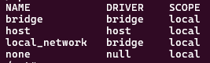

#### Сервисы для локальной разработки с помощью Docker Compose
- Aiflow | http://localhost:8080
- ClickHouse Cluster (4 узла: 2 шарда, 2 реплики) | http://localhost:8123/play 
- Kafka c веб-интерфейс Kafdrop | http://localhost:9010
- RabbitMQ | http://localhost:15672

#### Все контейнеры созданы в одной сети "local_network". Перед использованием контейнера установить единую сеть.
#### Установить локальную сеть в Docker:
    docker network create local_network

#### Проверить установку локальной сети:
    docker network ls

#### Результат на скрине. Можно использовать контейнеры.

